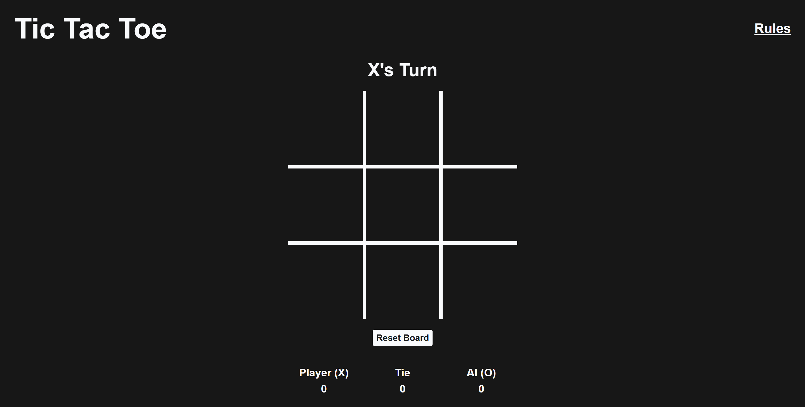

# Tic-Tac-Toe

## About

This project lets you verse against an unbeatable AI in Tic Tac Toe. Built using **TypeScript, React, TailwindCSS, and Vite**.

It’s just like any other simple game of tic tac toe, but the purpose was for me to get an understanding of how React applications are built. React’s basic tutorial to learn React is also a tic tac toe game, but instead of following that, I decided to make my own version. In the process, I learned more about React, especially component-based UI and state management using hooks.

You will never be able to beat the AI in this game that’s the whole point of the **Minimax algorithm**. It makes the AI choose the most optimal move every time.

## Live App

You can try out the **live version of the website** here:  
👉 [**Tic-Tac-Toe**](https://mjollnir03.github.io/Tic-Tac-Toe/)

## Website Demo

  

  <em>Desktop Screen</em>

## References

Sebastian Lague’s video [**Minimax Algorithm Explained**](https://www.youtube.com/watch?v=l-hh51ncgDI) is what influenced my minimax algorithm. I didn’t add alpha-beta pruning since the search space in Tic Tac Toe is small enough to work fine without it.

## Conclusion

This project helped me learn how React apps are put together. I got a better idea of how components, hooks, and state all work together, and I was also able to separate the game logic (TypeScript classes) from the UI (React).

This project also allowed me to experiment with **GitHub Actions**, deploying projects to GitHub Pages using workflows.

## Work in Progress

-   Add different levels of difficulty for the AI
-   Add animations and colors to the cells
